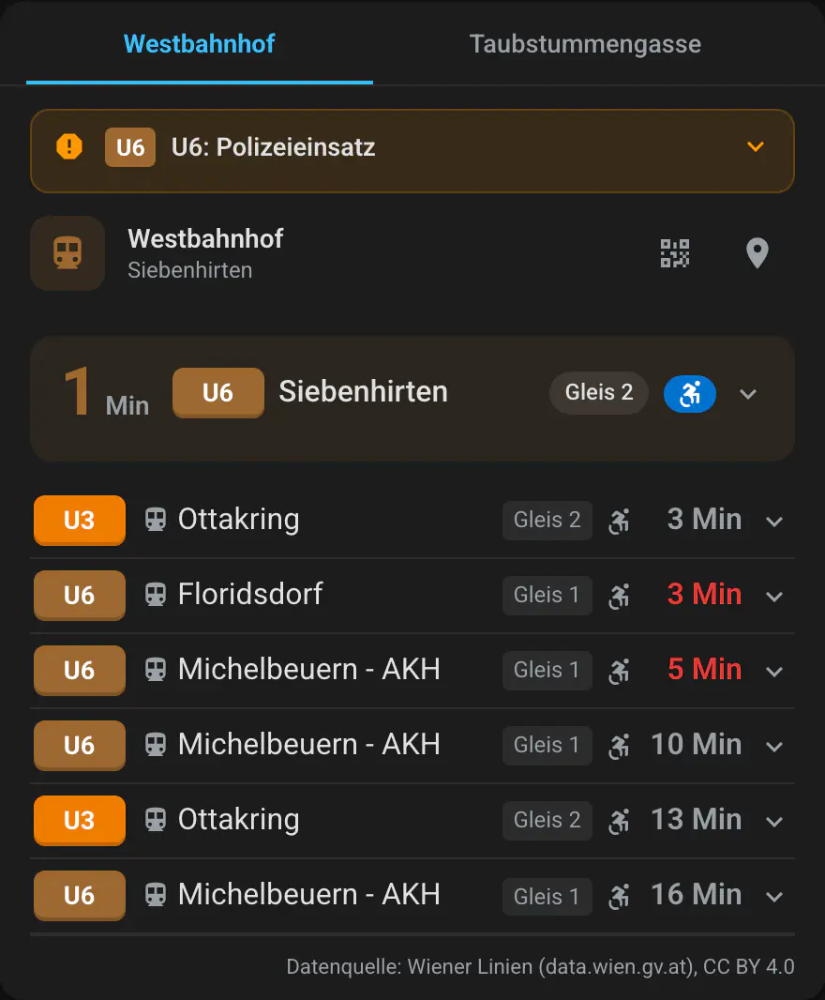
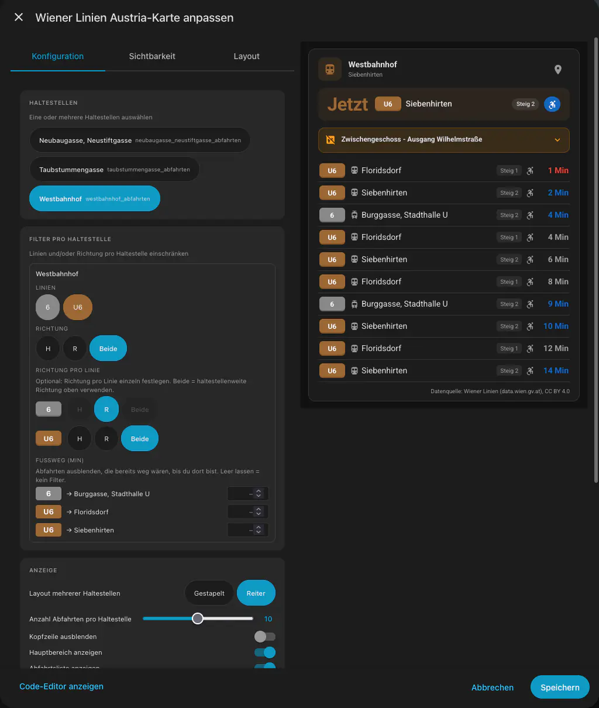
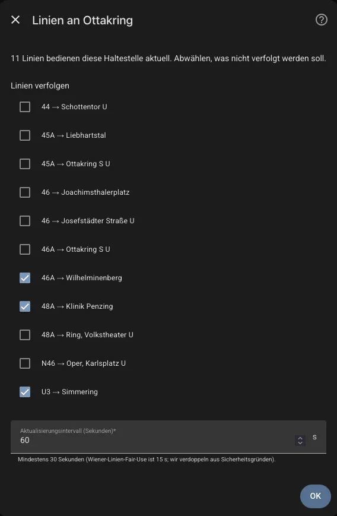

# Wiener Linien Austria

[](https://github.com/hacs/integration)
[](https://www.home-assistant.io/)
[](https://github.com/rolandzeiner/wiener-linien-austria/releases)
[](https://opensource.org/licenses/MIT)
[](https://en.wikipedia.org/wiki/Vibe_coding)

Home Assistant integration for Vienna public transport departures. Uses the official [Wiener Linien OGD real-time API](https://www.wienerlinien.at/open-data) — no API key, no YAML editing, no manual RBL lookups.

Type a stop name, pick it from a list, choose which lines to track. Done.

## Supported Functions

- Real-time departures for any Wiener Linien stop (U-Bahn, Straßenbahn, Autobus, Nightline).
- One sensor per configured stop. State is the countdown of the next overall departure; attributes carry the full board, per-line next-countdown map, platform (Gleis), stop coordinates, CC-BY attribution, and any matched alerts. See [Sensor Attributes](#sensor-attributes).
- Multi-step config flow: search → pick stop → pick lines. Live API probe during setup confirms connectivity and shows the exact lines currently serving the stop.
- Reconfigure flow to add/remove lines without losing the entry; options flow to change the polling interval without re-doing selection.
- **Service disruption alerts** (`trafficInfoList`) filtered to the lines you track — surfaced in the `traffic_info` sensor attribute.
- **Elevator outage alerts** (`Aufzugsinfo`) filtered to your stop's RBLs — surfaced in the `elevator_info` sensor attribute; critical for users who rely on step-free access.
- **Delay detection** — when `time_real` lags `time_planned`, the modern card renders "3 Minuten verspätet" inline (toggleable in the editor); the raw timestamps always stay on the sensor for templates.
- **Two bundled Lovelace cards** — modern full-feature + retro LED-display style. See [Lovelace Cards](#lovelace-cards).
- **Identifying User-Agent** on every outbound request (`HomeAssistant/{ver} wiener_linien_austria/{ver}`) so Wiener Linien can traffic-shape this integration specifically.
- Diagnostics download with attribution, coordinator state, last error code, server time, RBLs, and currently matched alerts.

## Screenshots

<table>
  <tr>
    <td align="center"></td>
    <td align="center"></td>
    <td align="center"></td>
  </tr>
  <tr>
    <td align="center"><em>Lovelace card</em></td>
    <td align="center"><em>Card editor</em></td>
    <td align="center"><em>Config flow</em></td>
  </tr>
</table>

## Requirements

- Home Assistant **2025.1** or newer.
- **No API key** needed — the Wiener Linien OGD service is key-free since 2019.
- Outbound HTTPS access to `wienerlinien.at`.

## Installation

### HACS (recommended)

1. HACS → **Integrations** → ⋯ → **Custom repositories**.
2. Add `https://github.com/rolandzeiner/wiener-linien-austria` as type **Integration**.
3. Search for "Wiener Linien Austria" and install.
4. Restart Home Assistant.

[](https://my.home-assistant.io/redirect/hacs_repository/?owner=rolandzeiner&repository=wiener-linien-austria&category=integration)

### Manual

1. Copy `custom_components/wiener_linien_austria/` into your HA `config/custom_components/`.
2. Restart Home Assistant.

## Setup

[](https://my.home-assistant.io/redirect/config_flow_start/?domain=wiener_linien_austria)

1. **Settings → Devices & Services → + Add Integration**.
2. Search for **Wiener Linien Austria**.
3. Type part of a stop name (e.g. `Stephans`) and submit.
4. Pick the matching stop from the dropdown.
5. The integration calls the live `/monitor` endpoint and shows every line currently serving that stop. Pick the one or two you want to track — busy stops list 20+ lines.
6. Set a polling interval (default 60 s, minimum 30 s) and save.

Change tracked lines later via **Reconfigure**; change polling interval via **Configure** (options).

## Lovelace Cards

Two custom cards ship with the integration. Both register themselves as Lovelace resources automatically when the integration loads — no manual `resources:` editing required. Hard-refresh the browser (⌘⇧R / Ctrl⇧R) after upgrading to pick up new JS.

Both cards discover Wiener Linien sensors by attribute fingerprint (`diva` + `departures` + `Datenquelle: Wiener Linien` attribution prefix); no entity-name prefix required.

### Modern card — `wiener-linien-austria-card`

The everyday departure board. Dashboard → Add card → "Wiener Linien Austria" (under *Custom*).

**Editor (visual):**
- **Stops** — chip picker (multi-select) of every Wiener Linien sensor on this HA instance.
- **Per-stop filters** — for each selected stop, a second chip row lets you restrict which lines render and which direction (H / R / both).
- **Line colours** — colour-pickers per line appearing in any selected stop's board. Metro CI defaults are built in; tram/bus lines fall back to the theme primary colour until overridden.
- **Display** — multi-stop layout picker (*stacked* or *tabs*), departures-per-stop slider (1–20), and toggles for step-free icon (opt-in), disruption banner, elevator badge, delay text, and "Hide data source" (hides the attribution footer on your private dashboard — the sensor attribute keeps the CC-BY string).

**Each departure row** shows a colour-coded line badge (`METRO_COLORS` + user overrides), destination text with optional inline delay ("3 Minuten verspätet" when `time_real` > `time_planned` by ≥ 1 min), optional `mdi:alert-circle` for `traffic_jam`, optional `mdi:wheelchair-accessibility` for step-free departures, and a countdown cell showing `N min` or `jetzt` when ≤ 0.

**Disruption banner** — collapsible rows above the stop list, one per unique `traffic_info`. Each row: alert icon + line badges + title always visible; click to expand full description, location chip, "Bis" and "aktualisiert" timestamps.

**Elevator outage panel** — one warning row per affected elevator under the stop header. Always-visible summary (icon + platform location); expand for reason + return-to-service time. Always rendered inline (no tooltips) for accessibility.

**Stop title is a Google Maps link** — pinned to the exact `latitude` / `longitude` from the static catalogue, not a text search (short names like "Ottakring" otherwise resolve to the district centroid, not the station).

**Betriebsschluss handling** — when `departures` is empty but `server_time` is present, renders "Betriebsschluss" / "End of service" instead of the generic no-data message.

### Retro card — `wiener-linien-austria-retro-card`

A focused single-stop, single-direction LED-display style card mimicking the classic Wiener Linien platform signs. Dashboard → Add card → "Wiener Linien Austria Retro".

- Shows the **next 2 departures** for one direction of one station.
- Black background with a subtle violet LED-substrate dot pattern.
- Amber `#FFC700` glyphs in a system monospace stack — no Google-Fonts fetch (GDPR-clean, no third-party request).
- Amber **GLEIS** (rail) or **STEIG** (bus) panel when the API reports a platform; left-aligned for Gleis "2", right-aligned otherwise, mirroring real Wiener Linien platform signs.
- Wheelchair glyph in amber LED tone after the destination on step-free departures.
- Alternating asterisks blink in place of the countdown when a train is at the platform (`countdown ≤ 0`), matching the real LED boards.
- Three size variants (small / medium / regular) for narrow mobile cards, tablet dashboards, or full-width wall displays.
- Editor: stop chip picker, H/R direction toggle, optional single-line filter, size picker, and a show-platform toggle.

Designed for wall-tablet kiosks, entryway displays, and anyone who wants their HA dashboard to feel like an actual station board.

### Card registration

Each card file is served under a versioned URL from the integration (`/wiener-linien-austria/*-card.js?v=X.Y.Z`). A WebSocket version check warns users with a reload banner if the backend bumps the card version while an old JS is cached in the browser. The modern and retro cards version independently — bumping one does not trigger a banner on the other.

## Sensor Attributes

Every `sensor.{stop}_abfahrten` entity carries:

| Attribute | Type | Example / notes |
|---|---|---|
| `state` (native value) | int \| None | Countdown of the next overall departure, in minutes. `None` at end of service. |
| `attribution` | string | `"Datenquelle: Wiener Linien (data.wien.gv.at), CC BY 4.0"` — always present. |
| `diva` | int | Station identifier (e.g. `60201012` for Stephansplatz). |
| `stop_name` | string | Human-readable station name. |
| `latitude` / `longitude` | float \| None | Station coordinates from the static catalogue. |
| `server_time` | ISO string \| None | Wiener Linien `serverTime` from the last successful fetch. |
| `departures` | list[dict] | Capped at 30 entries, sorted by countdown. Each dict: `line`, `towards`, `direction` ("H"/"R"), `type` (`ptMetro`/`ptTram`/`ptBusCity`/`ptBusNight`), `countdown`, `time_planned` (ISO), `time_real` (ISO), `realtime` (bool), `barrier_free` (bool), `traffic_jam` (bool), `platform` (string, e.g. `"1"`). |
| `next_by_line` | dict[str, int] | Per-line map to the earliest countdown. E.g. `{"U1": 2, "U4": 6}`. |
| `traffic_info` | list[dict] | Service disruptions matching the tracked lines. Fields: `name`, `title`, `description`, `description_html`, `related_lines`, `line_types`, `location`, `time_start`, `time_end`, `time_created`, `time_last_update`, `status` (only `"active"` surfaces). |
| `elevator_info` | list[dict] | Elevator outages matching the stop's RBLs. Fields: `name`, `station`, `description`, `reason`, `status`, `related_lines`, `related_stops`, `time_start`, `time_end`. |

The 30-departure cap on `departures` keeps busy multi-line stops under HA's 16 KB attribute cap so the recorder doesn't drop state. The card's `max_departures` setting is capped at 20, so nothing displayed is ever clipped by the attribute cap.

## Data Updates

The integration talks to three Wiener Linien OGD endpoints on different cadences:

| What | Endpoint | Cadence |
|---|---|---|
| Live departures per stop | `/monitor?stopId=…` | Per-entry, user-configurable (default 60 s, min 30 s, max 600 s) |
| Traffic + elevator alerts | `/trafficInfoList?name=stoerunglang` + `?name=aufzugsinfo` | Domain-wide, 5 min (shared across all entries) |
| Static stop catalogue | `wienerlinien-ogd-haltestellen.csv` + `-haltepunkte.csv` | Weekly refresh, cached to HA storage |

All outbound calls share a **15 s domain-wide cooldown** so multi-entry setups never aggregate into a fair-use violation. Wiener Linien's fair-use policy allows ≥ 15 s between requests; we enforce a 30 s per-entry floor on the departures poll on top of that. If the API ever responds with error code 316 (rate limit exceeded), the integration raises a **Repairs issue** and automatically backs off until the next successful fetch.

Alert caches are shared across all entries — even with five configured stops, total traffic + elevator fetch traffic is just two requests every five minutes for the whole integration.

**Transient failures serve stale data.** A single failed poll (timeout, 5xx, temporary rate-limit) does NOT flip the sensor to `unavailable` — the coordinator keeps the last successful departure board visible until the next good fetch. Templates can still detect staleness via the `server_time` attribute. Only a never-successful integration (fresh install with a broken API) stays unavailable.

## Use Cases

- **Leave-now notifications** — "if the next U1 towards Leopoldau is < 3 min, notify me".
- **Dashboard departure board** — multi-line attribute-driven card shows the next 5 departures per stop.
- **Automations triggered by specific lines** — e.g. turn on the entrance light when the tram arrives.
- **Travel time comparison** — track two stops (home + alternate) and let a template sensor pick whichever has the sooner departure.

## Automation Examples

Notify when the next train is close:

```yaml
alias: "Train coming — leave now"
trigger:
  - platform: numeric_state
    entity_id: sensor.stephansplatz_departures
    below: 3
action:
  - service: notify.mobile_app_phone
    data:
      title: "Next departure at Stephansplatz"
      message: >
        
        {{ next.line }} → {{ next.towards }} in {{ next.countdown }} min
```

Template sensor for the next U1 to Leopoldau only:

```yaml
template:
  - sensor:
      - name: "Next U1 Leopoldau"
        state: >
          
          
          {{ matches[0].countdown if matches else 'none' }}
        unit_of_measurement: min
```

## Troubleshooting

**"Cannot reach the Wiener Linien real-time API" during setup.** The integration probes `/monitor` with all RBLs of the chosen station before saving. If the probe fails, either the API is temporarily down or outbound HTTPS from your HA host is blocked. Retry after a minute.

**"No stops match this search".** The static catalogue was loaded but your query didn't match. Try shorter or partial names (e.g. `Karls` → matches Karlsplatz, Karlskirche, …). Umlauts matter — "Wien Mitte" works, "wien mitte" also works (search is case-insensitive).

**A Repairs issue "Wiener Linien rate limit hit" appeared.** Wiener Linien returned error 316. The default 60 s interval is well within their fair-use policy, so this only happens if many HA instances behind the same outbound IP (e.g. a corporate NAT) saturate the shared allowance. Raise the scan interval in Options, reduce concurrent entries, or ignore it — the integration recovers automatically.

**Collecting diagnostics for a bug report.** Settings → Devices & Services → Wiener Linien Austria → ⋯ → Download diagnostics. The JSON includes attribution, the RBL list, last error code, and coordinator timing. No personal data.

**Debug logs:**

```yaml
# configuration.yaml
logger:
  default: info
  logs:
    custom_components.wiener_linien_austria: debug
```

## Known Limitations

- **Vienna only.** The Wiener Linien API covers Wiener Linien routes; ÖBB / VOR / regional services are outside its scope.
- **Polling floor of 30 s** per entry, 15 s domain-wide cooldown across all entries. You cannot go below these; they exist to respect Wiener Linien's fair-use policy.
- **No journey planning.** The OGD monitor endpoint returns departures at a stop; it does not do routing.
- **Static catalogue refreshes weekly.** Brand-new stops may take up to a week to appear in search until the cache rebuilds.

## Attribution

All live data is © Wiener Linien and published under the [CC BY 4.0](https://creativecommons.org/licenses/by/4.0/) license. The integration emits this attribution on every sensor (`attribution` attribute) and in every diagnostics download:

> Datenquelle: Wiener Linien (data.wien.gv.at), CC BY 4.0

If you build a Lovelace card or other user-facing UI on top of this integration, please keep the attribution visible.

## Removal

1. **Settings → Devices & Services** → find Wiener Linien Austria → ⋯ → **Delete**.
2. Remove `custom_components/wiener_linien_austria/` from the HA config (manual installs only; HACS removes it automatically).

## License

MIT — see [LICENSE](LICENSE). The integration code is MIT; the Wiener Linien data flowing through it is CC BY 4.0.

## Disclaimer

This integration is not affiliated with or endorsed by Wiener Linien GmbH & Co KG. All departure and stop data is provided by the [Wiener Linien OGD real-time API](https://www.wienerlinien.at/open-data) and published under the Creative Commons Attribution (CC BY 4.0) license. The developer assumes no liability for the accuracy, completeness, or timeliness of the displayed departures, including delays, cancellations, or disruptions. Use at your own risk.

---

Diese Integration steht in keiner Verbindung zur Wiener Linien GmbH & Co KG und wird von dieser nicht unterstützt. Alle Abfahrts- und Haltestellendaten stammen von der [Wiener Linien OGD Echtzeit-API](https://www.wienerlinien.at/open-data) und werden unter der Creative-Commons-Lizenz Namensnennung 4.0 (CC BY 4.0) veröffentlicht. Für die Richtigkeit, Vollständigkeit und Aktualität der angezeigten Abfahrten — einschließlich Verspätungen, Ausfällen oder Störungen — wird keine Haftung übernommen. Nutzung auf eigene Verantwortung.
