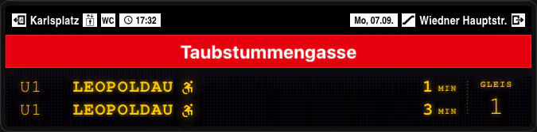
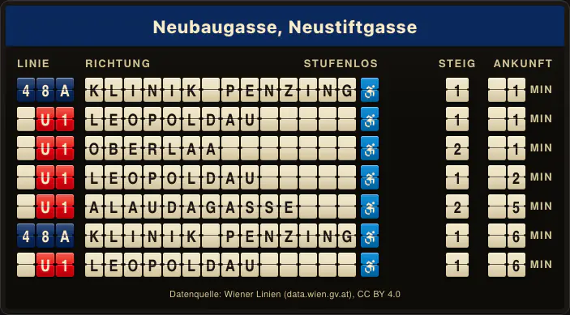
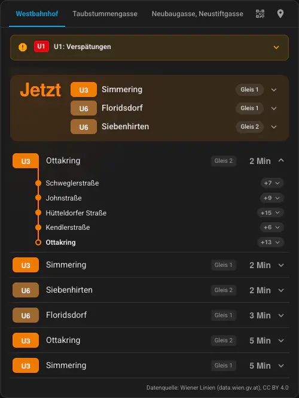
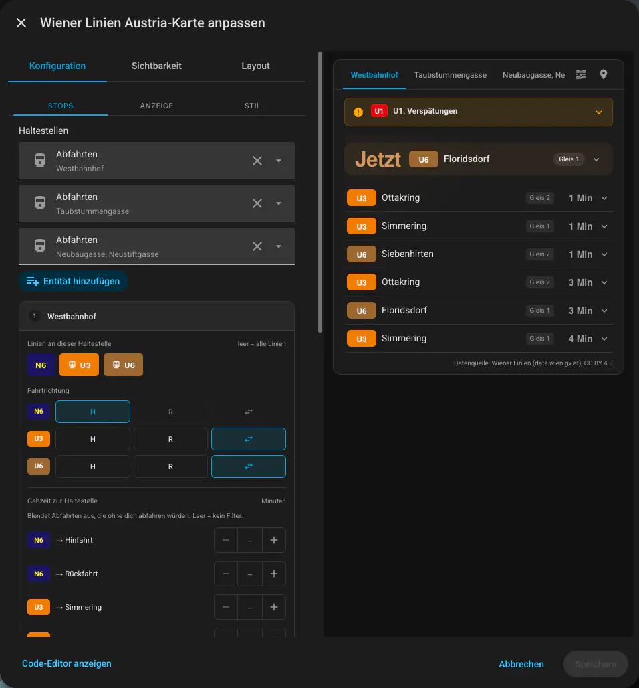
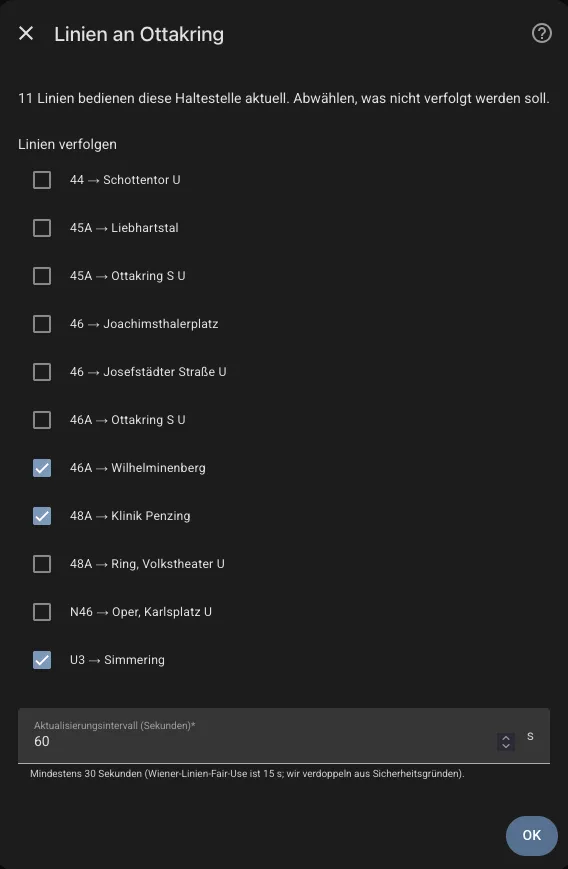

# Wiener Linien Austria

[](https://github.com/hacs/integration)
[](https://www.home-assistant.io/)
[](https://github.com/rolandzeiner/wiener-linien-austria/releases)
[](https://opensource.org/licenses/MIT)
[](https://en.wikipedia.org/wiki/Vibe_coding)
[](https://demo.rolandzeiner.at/#wien)

Vienna public transport departures for Home Assistant. Start typing your stop, choose the lines you care about — done. Uses the official [Wiener Linien OGD real-time API](https://www.wienerlinien.at/open-data): no API key, no YAML, no RBL lookups.

## Supported Functions

- **Live departures** for any U-Bahn, Straßenbahn, Autobus or Nightline stop. One sensor per stop; state is the next-departure countdown, attributes carry the full board.
- **Three Lovelace cards** — modern board, retro LED panel, Solari split-flap. See [Lovelace Cards](#lovelace-cards).
- **Service + elevator alerts** filtered to your tracked lines and stop, surfaced as `traffic_info` / `elevator_info` attributes and rendered inline by every card. Disruption notices break out into per-line headings, the reason, and how long it's expected to last — each with its own pictogram — so you can find your line without reading the whole notice *(1.7.3)*.
- **Stops-ahead trail** — expand any departure on the modern card into a metro-style trail showing every upcoming stop on that trip with transfer-line chips.
- **Air-conditioning flag** — a snowflake beside departures whose vehicle is air conditioned, off by default and switched on per card. Wiener Linien report it per vehicle, so older trains and trams simply don't carry it *(1.8.0)*.
- **Autocomplete stop entry** — type a stop name and the full catalogue filters as you go, with the stops nearest your Home Assistant location offered first and their distance shown. Submit a partial name and you get the matching stops to choose from. The line picker merges the live `/monitor` window with the static schedule catalogue, so day-only and nightline services both stay selectable regardless of when you configure.
- **Batched polling** — stops sharing a polling interval are fetched in one request per tick instead of one each, so adding stops no longer multiplies API load or your odds of hitting the rate limit.
- **Stale-data guard** — Wiener Linien occasionally keeps answering with a frozen board: in August 2026 every U-Bahn stop served the same departure for 60 hours, its delay growing by a minute each minute. Records whose planned time has stopped advancing are now dropped, the sensor reports no countdown instead of a stuck `0`, and the cards say the live data is out of date rather than calling it end of service *(1.7.8)*.
- **Reconfigure** to add or remove lines without losing the entry; **Configure** to change the polling interval.

## Screenshots

<table>
  <tr>
    <td align="center" valign="top">
      
      <br/>
      
      <br/>
      
    </td>
    <td align="center"></td>
    <td align="center"></td>
  </tr>
  <tr>
    <td align="center"><em>Lovelace cards (Retro · Flap · Modern)</em></td>
    <td align="center"><em>Card editor</em></td>
    <td align="center"><em>Config flow</em></td>
  </tr>
</table>

## Requirements

- Home Assistant **2025.1** or newer
- Outbound HTTPS to `wienerlinien.at`
- No API key (Wiener Linien OGD has been key-free since 2019)

## Installation

### HACS (recommended)

1. HACS → **Integrations** → ⋯ → **Custom repositories**
2. Add `https://github.com/rolandzeiner/wiener-linien-austria`, category **Integration**
3. Search for "Wiener Linien Austria" and install
4. Restart Home Assistant

[](https://my.home-assistant.io/redirect/hacs_repository/?owner=rolandzeiner&repository=wiener-linien-austria&category=integration)

### Manual

Copy `custom_components/wiener_linien_austria/` into your HA `config/custom_components/` and restart.

## Setup

[](https://my.home-assistant.io/redirect/config_flow_start/?domain=wiener_linien_austria)

1. **Settings → Devices & Services → + Add Integration**, search **Wiener Linien Austria**.
2. Start typing in **Stop** (e.g. `Stephans`) and pick a suggestion. The list opens on the stops nearest your Home Assistant location, with distances shown. Submitting a partial name instead brings up every stop that matches it.
3. Pick the lines to track. Off-service lines (nightlines during the day, day-only lines after midnight) stay selectable — the picker merges live `/monitor` data with the static catalogue.
4. Set a polling interval (default 60 s, range 30–600 s) and save.

Tracked lines change via **Reconfigure**; polling interval via **Configure**.

## Lovelace Cards

Three cards ship with the integration. All three auto-register as Lovelace resources, discover Wiener Linien sensors by attribute fingerprint (no entity-name prefix required), and version independently with a WebSocket handshake — a reload banner appears if your browser is on stale JS. Hard-refresh (⌘⇧R / Ctrl⇧R) after upgrading.

| Card | Best for | Stops | Style |
|---|---|---|---|
| **Modern** | Everyday dashboard, full feature set | Multi-stop | Themed HA card |
| **Retro** | Wall-tablet kiosks, entryway displays | Single stop / direction | Wiener Linien LED platform sign |
| **Flap** | Decorative boards, signage walls | Multi-stop | Solari split-flap mechanical board |

### Modern card — `wiener-linien-austria-card`

The everyday departure board. Themed to your HA palette; each stop auto-tints to its next-departure line colour.

- **Multi-stop layout** — stacked or tabbed; up to 20 departures per stop.
- **Hero countdown** — next departure rendered large, full board beneath.
- **Stops-ahead trail** — click any row to expand a metro-map trail down to the terminus, with transfer chips at each station.
- **Per-line walking time** — hides departures you can't reach in time.
- **QR map button** — encodes the stop as a `geo:` URI for phone scanners.
- **Disruption + elevator banners** — collapsible rows above the board.

Add via Dashboard → **Add card** → "Wiener Linien Austria".

### Retro card — `wiener-linien-austria-retro-card`

A focused LED panel, modelled on the amber-on-violet signs hanging from Wiener Linien platforms. The station-name tile picks up the configured line's colour (nightline blue + yellow on N-lines).

- **Three style variants** — *classic*, *warm*, *pixel* (screen-door overlay).
- **GLEIS / STEIG panel** — amber platform tile when the API reports one.
- **Signage header strip** — exit icon, sign text, WC / escalator / elevator tiles, free-form MDI icons, short labels. Per side.
- **Wheelchair race** — when ≥ 2 departures are step-free, runs a "3, 2, 1" countdown to the trophy finish. Tap to trigger.
- **Scrolling message** — custom text scrolls every 5 min, then hands back to live departures.

Add via Dashboard → **Add card** → "Wiener Linien Austria — Retro".

### Flap card — `wiener-linien-austria-flap-card`

A Solari split-flap board — characters cascade one tile at a time toward the target letter, mimicking the rattle of the mechanical originals from European stations.

- **Multi-stop merge** — up to 8 stops, sorted by countdown across the whole board.
- **Column headers** — *LINIE / RICHTUNG / STUFENLOS / GLEIS / ANKUNFT* above the board.
- **Per-row GLEIS / STEIG tile** — own column, aligned across all rows.
- **Station-name band** — auto-tints to the first tracked line's colour; editor dropdown lists each tracked line plus *White* and *Black*.
- **Signage header strip** — same grammar as the retro card, recoloured for the cabinet palette.
- **Compact mode** — hide the line column (single-line boards) or drop the cabinet for a flush mount.

Add via Dashboard → **Add card** → "Wiener Linien Austria — Flap Board".

## Sensor Attributes

Every `sensor.{stop}_abfahrten` entity carries:

| Attribute | Type | Notes |
|---|---|---|
| `state` (native value) | int \| None | Next-departure countdown in minutes. `None` at end of service. |
| `attribution` | string | `Datenquelle: Wiener Linien (data.wien.gv.at), CC BY 4.0` |
| `diva` | int | Station identifier (e.g. `60201012` for Stephansplatz). |
| `stop_name` | string | Human-readable station name. |
| `latitude` / `longitude` | float \| None | Station coordinates from the static catalogue. |
| `server_time` | ISO string \| None | `serverTime` from the last successful fetch. |
| `departures` | list[dict] | See [Departure shape](#departure-shape) below. Capped at 20 entries, sorted by countdown. |
| `next_by_line` | dict[str, int] | Per-line map to the earliest countdown — e.g. `{"U1": 2, "U4": 6}`. |
| `lines_at_stop` | list[str] | Every line serving this DIVA per the static schedule, regardless of live status. Populated once the trip-pattern catalogue has loaded. |
| `tracked_lines` | list[str] | Lines tracked in this entry. Card editors filter their pickers to this set. |
| `tracked_line_keys` | list[str] | Raw `{line}\|{direction}` keys used by the retro card editor to filter by direction. |
| `traffic_info` | list[dict] | Service disruptions matching tracked lines. Fields: `name`, `title`, `description`, `description_html`, `related_lines`, `line_types`, `location`, `time_start`, `time_end`, `time_created`, `time_last_update`, `status`. |
| `elevator_info` | list[dict] | Elevator outages matching the stop's RBLs. Fields: `name`, `station`, `description`, `reason`, `status`, `related_lines`, `related_stops`, `time_start`, `time_end`. |

The 20-departure cap bounds the attribute payload sent on every update, even when each row carries the full `stops_ahead` trail. The card's `max_departures` slider tops out at 20, so nothing displayed is clipped.

### Departure shape

Each entry in `departures` is a dict with: `line`, `towards`, `direction` (`"H"` / `"R"`), `type` (`ptMetro` / `ptTram` / `ptBusCity` / `ptBusNight`), `countdown`, `time_planned` (ISO), `time_real` (ISO), `realtime` (bool), `barrier_free` (bool), `traffic_jam` (bool), `platform` (e.g. `"1"`), and — when the static schedule resolves a matching trip — `stops_ahead`, an ordered list of `{name, is_terminus?, lines?}` down to the terminus. `lines` carries the *other* lines passing through each stop, used by the card to render transfer chips.

## Data Updates

Four OGD endpoints, on different cadences:

| What | Endpoint | Cadence |
|---|---|---|
| Live departures per stop | `/monitor?stopId=…` | Per-entry, default 60 s (30–600 s) |
| Traffic + elevator alerts | `/trafficInfoList` (×2) | Domain-wide, 5 min — shared across all entries |
| Static stop catalogue | `wienerlinien-ogd-haltestellen.csv` + `-haltepunkte.csv` | Weekly, cached to HA storage |
| Line catalogue + trip patterns | `wienerlinien-ogd-linien.csv` + `-fahrwegverlaeufe.csv` | Weekly, cached — powers the stops-ahead trail |

All outbound calls share a **15 s domain-wide cooldown** plus a 30 s per-entry floor — at or above the conventional 15-second minimum interval circulated for the OGD real-time endpoint (Wiener Linien doesn't publish a numeric rate cap, so the 15 s figure is convention rather than written rule). Every request sends `Accept-Encoding: gzip` and conditional-GET validators (`If-None-Match` / `If-Modified-Since`) so unchanged ticks return `304 Not Modified` and reuse the cached payload, halving steady-state bandwidth. An identifying User-Agent (`HomeAssistant/{ver} wiener_linien_austria/{ver}`) goes on every request so Wiener Linien can traffic-shape this integration specifically.

> **After a Home Assistant restart**: the alert feeds (`traffic_info` / `elevator_info`) refresh on a 5-min cadence, so they may be empty for up to 5 min before the first refresh lands. Departures fetch immediately on the per-entry cadence.

**Failure handling.** A single failed poll keeps the user-configured cadence and serves the last successful board (templates can detect staleness via `server_time`). From the second consecutive failure, the interval doubles each tick, capped at 30 min, until a successful fetch resets it. If the API responds with rate-limit error 316, a Repairs issue is raised and cleared automatically when the API recovers. Only a never-successful integration stays unavailable.

## Use Cases

- **Leave-now notifications** — "if the next U1 toward Leopoldau is under 3 min, notify me".
- **Dashboard departure board** — one of the bundled cards, or your own attribute-driven card.
- **Line-triggered automations** — turn on the entrance light when the tram is approaching.
- **Travel-time comparison** — track two stops and pick whichever has the sooner departure.

## Automation Examples

Notify when the next train is close:

```yaml
alias: "Train coming — leave now"
trigger:
  - platform: numeric_state
    entity_id: sensor.stephansplatz_abfahrten
    below: 3
action:
  - service: notify.mobile_app_phone
    data:
      title: "Next departure at Stephansplatz"
      message: >
        
        {{ next.line }} → {{ next.towards }} in {{ next.countdown }} min
```

Template sensor for the next U1 to Leopoldau only:

```yaml
template:
  - sensor:
      - name: "Next U1 Leopoldau"
        state: >
          
          
          {{ matches[0].countdown if matches else 'none' }}
        unit_of_measurement: min
```

## Troubleshooting

**"Cannot reach the Wiener Linien real-time API" during setup.** The integration probes `/monitor` with the chosen stop's RBLs before saving. The API is temporarily down or outbound HTTPS from your HA host is blocked. Retry in a minute.

**"No stops match this search".** Try shorter or partial names (`Karls` matches Karlsplatz, Karlskirche, …). Case-insensitive; umlauts matter.

**Repairs issue "Wiener Linien rate limit hit".** Usually means many HA instances behind the same outbound IP share the OGD allowance. Raise the scan interval, reduce concurrent entries, or ignore — the integration recovers automatically.

**Bug reports.** Settings → Devices & Services → Wiener Linien Austria → ⋯ → **Download diagnostics**. The JSON includes attribution, RBL list, last error code, and coordinator timing. No personal data.

**Debug logs:**

```yaml
# configuration.yaml
logger:
  default: info
  logs:
    custom_components.wiener_linien_austria: debug
```

## Known Limitations

- **Vienna only.** ÖBB, VOR, and regional services are out of scope.
- **No journey planning.** The OGD monitor returns departures at a stop; routing is not provided.
- **Static catalogue refreshes weekly.** Brand-new stops may take up to a week to appear in search.
- **Stops-ahead is best-effort.** Short-turn services may show the full scheduled path. Replacement bus (SEV) and unscheduled detours produce no panel — the row stays as today, no chevron.

## Removal

1. **Settings → Devices & Services** → Wiener Linien Austria → ⋯ → **Delete**.
2. Remove `custom_components/wiener_linien_austria/` from HA config (manual installs only; HACS handles it).

## Attribution

All live data is © Wiener Linien and published under the [CC BY 4.0](https://creativecommons.org/licenses/by/4.0/) license. The integration surfaces this on every sensor (`attribution` attribute) and in every diagnostics download:

> Datenquelle: Wiener Linien (data.wien.gv.at), CC BY 4.0

If you build a Lovelace card or other user-facing UI on top of this integration, please keep the attribution visible.

## License

MIT — see [LICENSE](LICENSE). Integration code is MIT; the Wiener Linien data flowing through it is CC BY 4.0.

**Bundled webfonts** (`custom_components/wiener_linien_austria/www/fonts/`) — `WL Sans`, `WL Sans Condensed`, and `WL Mono` are subsetted derivatives of the [TeX Gyre](https://www.gust.org.pl/projects/e-foundry/tex-gyre) family (Heros / Heros Cn / Cursor) by Bogusław Jackowski and Janusz M. Nowacki on behalf of GUST. The fonts ship under the [GUST Font License](custom_components/wiener_linien_austria/www/fonts/GUST-FONT-LICENSE.txt) (LPPL 1.3c+) and were renamed per the GFL's request that derivatives use new names. See [`www/fonts/NOTICE.md`](custom_components/wiener_linien_austria/www/fonts/NOTICE.md) for provenance, the exact subset, and reproduction steps.

## Disclaimer

This integration is not affiliated with or endorsed by Wiener Linien GmbH & Co KG. All departure and stop data is provided by the [Wiener Linien OGD real-time API](https://www.wienerlinien.at/open-data) under the Creative Commons Attribution (CC BY 4.0) license. The developer assumes no liability for the accuracy, completeness, or timeliness of the displayed departures, including delays, cancellations, or disruptions. Use at your own risk.

---

Diese Integration steht in keiner Verbindung zur Wiener Linien GmbH & Co KG und wird von dieser nicht unterstützt. Alle Abfahrts- und Haltestellendaten stammen von der [Wiener Linien OGD Echtzeit-API](https://www.wienerlinien.at/open-data) und werden unter der Creative-Commons-Lizenz Namensnennung 4.0 (CC BY 4.0) veröffentlicht. Für die Richtigkeit, Vollständigkeit und Aktualität der angezeigten Abfahrten — einschließlich Verspätungen, Ausfällen oder Störungen — wird keine Haftung übernommen. Nutzung auf eigene Verantwortung.
